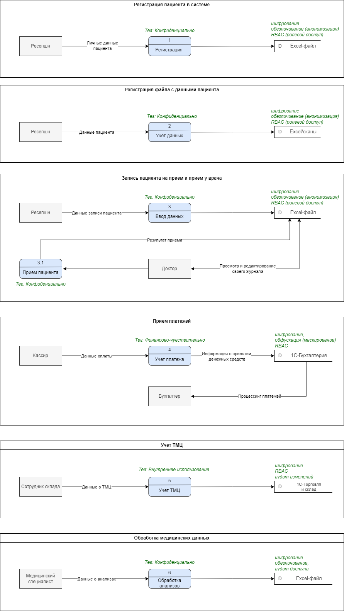

# Задание 1

## 1. Выявление конфиденциальных данных.

[Диаграмма потоков данных в формате drawio](fd.drawio)

## 2. Аудит мер по обеспечению безопасности данных. 
### 1. **Сопоставление процессов с требованиями и практиками**
#### **Процесс: Запись пациента на прием и прием у врача**
- **Текущее состояние:** Данные хранятся в Excel-файлах на общем диске.
- **Проблемы:**
  - Нет шифрования данных.
  - Нет контроля доступа.
  - Нет тегирования данных.
- **Рекомендации:**
  - Внедрить CRM с шифрованием данных.
  - Настроить RBAC для контроля доступа.
  - Тегировать данные как Конфиденциально.
-----
#### **Процесс: Регистрация пациента в системе, Регистрация файла с данными пациента**
- **Текущее состояние:** Данные хранятся в Excel и сканах на общем диске.
- **Проблемы:**
  - Нет централизованного хранения.
  - Нет защиты данных.
  - Нет аудита изменений.
- **Рекомендации:**
  - Внедрить CRM с шифрованием и тегированием данных.
  - Настроить аудит доступа и изменений.
-----
#### **Процесс: Приём платежей**
- **Текущее состояние:** Данные вносятся в 1С.
- **Проблемы:**
  - Нет шифрования финансовых данных.
  - Нет интеграции между ККМ и 1С.
- **Рекомендации:**
  - Внедрить шифрование данных в 1С.
  - Интегрировать ККМ с 1С.
-----
#### **Процесс: Учёт ТМЦ**
- **Текущее состояние:** Данные хранятся в 1С Торговля и склад.
- **Проблемы:**
  - Нет контроля доступа.
  - Нет аудита изменений.
- **Рекомендации:**
  - Настроить RBAC для контроля доступа.
  - Внедрить аудит изменений.
-----
#### **Процесс: Обработка медицинских данных**
- **Текущее состояние:** Данные хранятся в Excel на общем диске.
- **Проблемы:**
  - Нет шифрования данных.
  - Нет тегирования данных.
- **Рекомендации:**
  - Внедрить CRM с шифрованием и тегированием данных.
  - Настроить аудит доступа.
-----
#### **Процесс: Обработка медицинских данных**
- **Текущее состояние:** Данные передаются вручную.
- **Проблемы:**
  - Нет интеграции с лабораторией через API.
  - Нет шифрования данных при передаче.
- **Рекомендации:**
  - Интегрировать лабораторию через API с шифрованием данных.
  - Тегировать данные как Конфиденциально.
### 2. **Список проблемных зон**
- **Отсутствие централизованной системы хранения данных:**
   Данные хранятся в разных форматах (Excel, сканы, 1С), что усложняет их обработку и анализ.
- **Недостаточная защита данных:**
   Конфиденциальные данные не защищены от несанкционированного доступа. Нет шифрования, тегирования и контроля доступа.
- **Ручной ввод данных:**
   Большинство процессов требуют ручного ввода данных, что увеличивает вероятность ошибок.
- **Отсутствие аудита и мониторинга:**
   Нет логирования действий с данными.
- **Несоответствие законодательству:**
   Не соблюдаются требования ФЗ-152 (О персональных данных).
- **Отсутствие интеграции:**
   Нет автоматической передачи данных между системами (например, между лабораторией и медицинскими картами).

## 3. Что можно улучшить
### **1. Список данных для защиты и способы их защиты**

|**Категория данных**|**Примеры данных**|**Способы защиты**|
| :- | :- | :- |
|**Персональные данные (PII)**|ФИО, телефон, email, дата рождения|Шифрование, обезличивание (анонимизация), RBAC (ролевой доступ).|
|**Медицинские данные**|Диагнозы, анализы, назначения|Шифрование, обезличивание, тегирование, аудит доступа.|
|**Финансовые данные**|Платёжные реквизиты, данные о контрактах|Шифрование, обфускация (маскирование), RBAC.|
|**Данные сотрудников**|ФИО, телефоны, зарплата, налоги|Шифрование, обезличивание, RBAC.|
|**Товарно-материальные ценности**|Данные о закупках, расходе материалов|Шифрование, RBAC, аудит изменений.|

-----
### **2. Механизм тегирования данных**

Тегирование данных позволяет классифицировать информацию по уровню конфиденциальности и автоматически применять меры защиты.

**Категории тегов:**

- **Конфиденциально:** Персональные данные, медицинские данные.
- **Финансово-чувствительно:** Платёжные реквизиты, данные о контрактах.
- **Внутреннее использование:** Данные сотрудников, ТМЦ.

**Инструменты тегирования:**

- **Microsoft Information Protection (MIP):** Для классификации и защиты данных в Office 365.
- **Apache Atlas:** Для тегирования данных в озере данных (Data Lake).
- **Varonis:** Для автоматического тегирования и защиты данных.

**Пример тегирования:**

- Данные пациента: Конфиденциально.
- Платёжные реквизиты: Финансово-чувствительно.
- Данные о закупках: Внутреннее использование.
-----
### **3. Инструменты, способы и меры для обеспечения конфиденциальности**

**Инструменты:**

- **Шифрование:** AES-256, TLS для передачи данных.
- **Обфускация:** Маскирование данных (например, скрытие части номера телефона).
- **Обезличивание:** Анонимизация данных (например, замена ФИО на уникальный идентификатор).
- **RBAC/ABAC:** Ролевой и атрибутный доступ к данным.
- **Аудит:** Логирование действий с данными (например, с помощью Splunk или ELK Stack).

